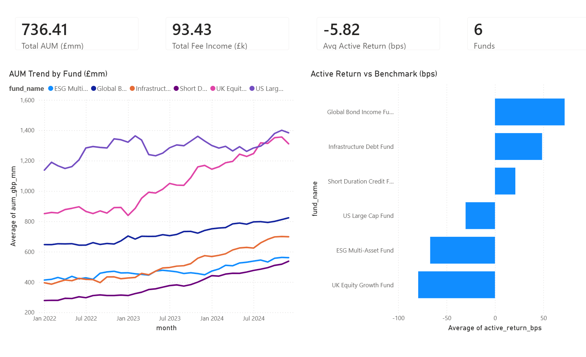
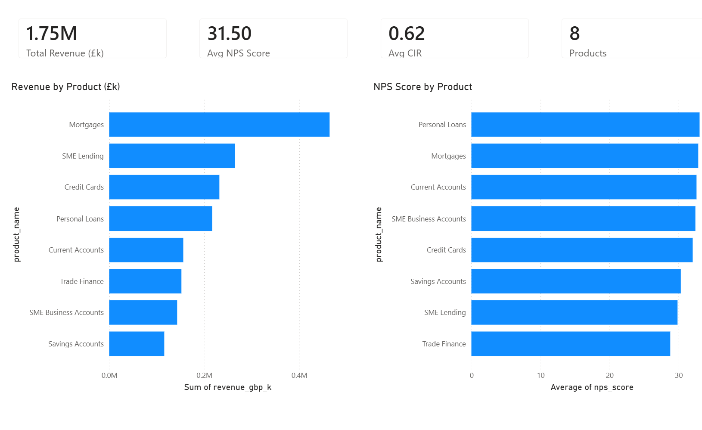
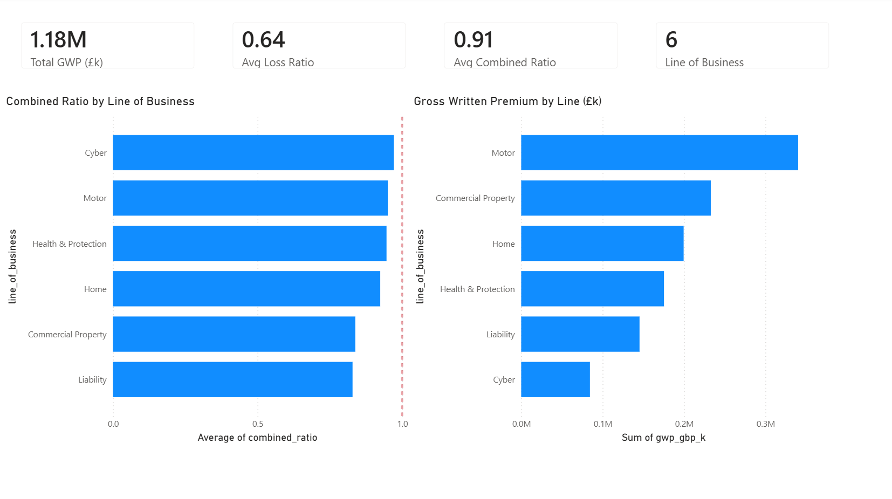
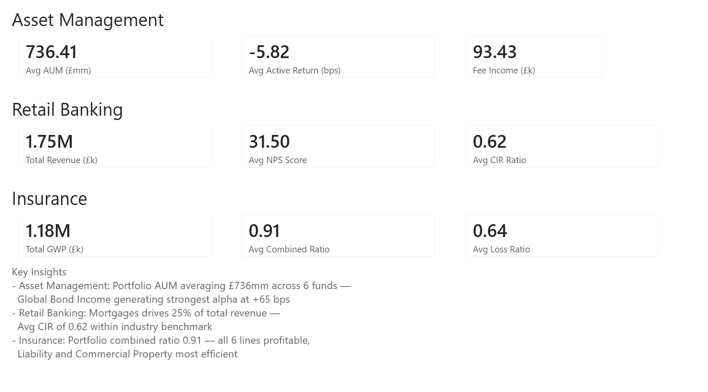

# Financial Services KPI Dashboard

A cross-sector analytics dashboard covering three FS sectors built in Power BI.

## Sectors Covered
- **Asset Management** — 6 funds, AUM tracking, active return vs benchmark
- **Retail Banking** — 8 products, revenue, NPS, cost-income ratio
- **Insurance** — 6 lines of business, combined ratio, GWP, underwriting profit

## Key Metrics
| Sector | Headline KPI | Value |
|--------|-------------|-------|
| Asset Management | Avg AUM | £736mm across 6 funds |
| Asset Management | Avg Active Return | -5.82 bps (2022 bear market drag) |
| Asset Management | Fee Income | £93.43k |
| Retail Banking | Total Revenue | £1.75M |
| Retail Banking | Avg NPS Score | 31.50 |
| Retail Banking | Avg CIR | 0.62 (within benchmark) |
| Insurance | Total GWP | £1.18M |
| Insurance | Avg Combined Ratio | 0.91 (profitable) |
| Insurance | Avg Loss Ratio | 0.64 |

## Dashboard Pages
1. **Asset Management** — AUM trend by fund (Jan 2022–Dec 2024), active return vs benchmark, year slicer
2. **Retail Banking** — Revenue by product, NPS by product
3. **Insurance** — Combined ratio by line (with 1.0 reference line), GWP by line
4. **Group Summary** — Executive overview across all three sectors with key insights

## Screenshots

## Tech Stack
- **Power BI Desktop** — 4-page dashboard
- **DAX** — KPI measures
- **Excel** — 6-sheet financial model (industry colour coding)
- **Python** — data generation (pandas, numpy)

## Excel Financial Model
`FS_KPI_Financial_Model.xlsx` — 6 sheets with industry-standard colour coding:
- 🔵 Blue text = hardcoded inputs
- ⚫ Black text = formulas
- 🟢 Green text = cross-sheet links
- 🟡 Yellow background = key assumptions

## Data
756 rows across 4 CSV files — synthetic data using real FS industry
terminology, metrics, and realistic value ranges (Jan 2022–Dec 2024).

## Key Insights
- **Asset Management:** Global Bond Income and Infrastructure Debt generate
  positive alpha — UK Equity Growth underperforms benchmark
- **Retail Banking:** Mortgages drives highest revenue; Trade Finance has
  lowest NPS score — opportunity for service improvement
- **Insurance:** All 6 lines profitable (combined ratio < 1.0);
  Liability and Commercial Property most efficient lines

---
*Attic C. Lee — CV Portfolio Project A*
